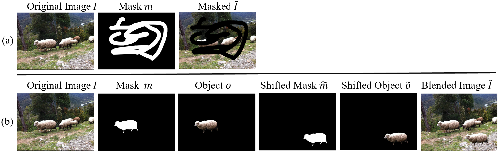

# MagicEraser: Erasing Any Objects via Semantics-Aware Control



### How to build the Object-Level-Remove-Dataset (OLRD)?

OLRD is based on [Place2](http://places2.csail.mit.edu/index.html) and we show some object removal examples in folder `imgs ` and provides scripts to construct OLRD

1. Generate object level masks.
For example, the Mask2Former is applied to generate masks and use tag to pick out the object-level mask

```python
pip install git+https://github.com/facebookresearch/Mask2Former.git
python gen_object_level_masks.py
```
2. Build object-removal pairs
```python
python scripts/gen_object_removal_pairs.py
```

3 Generate captions

For example, the [Llava](https://llava-vl.github.io/) is applied to generate captions. The pipeline code is based on [transformer]()

```
pip install transformer
python scripts/gen_captions.py
```

